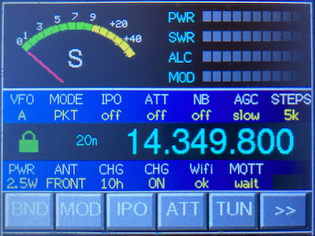
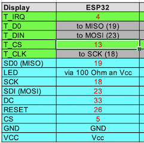
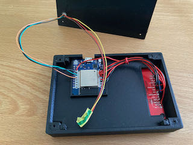
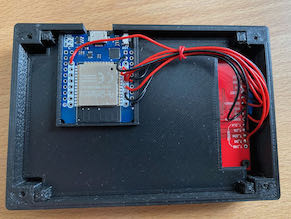

# FT-817-Touch Display

Application for the 'D1 mini ESP32 controller' connected to a 3.2 inch TFT display ILI9341 to control a Yaesu FT-818 or (with some small changes) the FT-817. The code is far away from optimized. Nevertheless I made it public to give others the chance to use or improve the code.

The CAT control part of the software is based on the excellent FT-817 library from Pavel Milanes (https://github.com/stdevPavelmc/ft817), which I extended to add new functions.
Thanks to Clint Turner (KA7OEI) for his huge information about controlling the FT-817 via CAT commands (http://www.ka7oei.com/ft817_meow.html)

Some background information for controlling the FT-817/FT-818:
The FT-817/818 is not notifying a connected controller in case a user changes its settings, frequency etc. Instead, a CAT program has to poll the TRX in a loop for each setting, which it would like to know. As each request towards the TRX takes a relevant time, the time to step through the loop grows if the number of requested settings increases. To ensure, that the frequency on the TFT display is following quickly the changes on the TRX, the frequency in the loop is much more often requested than the other settings.

<b>Warning</b> 
Changes of settings across the CAT interface are done in most cases by writing to the EEPROM of the FT-817/818. As described by Clint Turner (s. link above),<b>this could harm the transceiver, can delete the factory settings and can lead to a defect device</b>. But even if the write commands are sent in the right format, accidently writing to the EEPROM frequently (e.g. in a loop) can destroy the EEPROM after a certain (big) number of cycles. The minimum action you should take is to backup the "soft calibration" settings BEFORE you apply this software! Please read the details on Clint's web page! In the provided software EEPROM-write is disabled, but can be enabled in ft817.h (comment out "#define NO_EEPROM_WRITE"). 

<b>Compile the software for the FT-818</b> 
I used PlatformIO instead of Arduino IDE, but the last one should work as well after manual import of the libraries.  
Used libraries: 

PlatformIO should load the following three libraries automatically. Using Arduino IDE instead might need manually loading these libraries:
https://github.com/PaulStoffregen/XPT2046_Touchscreen 
https://github.com/bblanchon/ArduinoJson 
https://github.com/plapointe6/EspMQTTClient 
 
Included in lib folder are modified libraries based on 
https://github.com/stdevPavelmc/ft817 
https://github.com/Bodmer/TFT_eSPI 
 
(1) Download the code from github as a zip file 
(2) Put it into the PlatformIO project folder and extract the files 
(3) Open it in PlatformIO ("Open Project") 
(4) "Build" or "Upload" 

Please note: Do NOT install the initial software, if you would like to connect the ESP32 via CAT interface to the FT-81<b>7</b>. I do not have a FT-817 and did not test it. The memory layout of the FT-817 is not completely the same as of the FT-818, meaning that it could lead to trouble!  
<b>Adapt the software to support the FT-817 instead of the FT-818 (UNTESTED!)</b> 
Open the file globals.h in the src folder and search for "#define FT818". Comment this line out (deactivate it). This will change the calculation of the base address (s. ft817.cpp, around line 930). But as I said - do it only on your risk! 
There might be other differences, e.g. reagrding the result codes of the command "Read Transmitter Status". I you recognize that during TX the bars PWR, SWR, MOD and ALC are reversed, check main.cpp, line 130, where "show_bar()" is called.  
<b>Enable MQTT</b> 
Wifi and MQTT are disabled by default. It can be activtated in globals.h. Look for #define MQTT and activate this line. In this case you also have to add your Wifi secrets and the mqtt broker details in mqtt.cpp.
  
<b>Limitations</b> 
(1) The sofware does not check, whether the TRX is connected 
(2) If the application does not get a Wifi connection or cannot connect to a MQTT broker, the application reboots (if MQTT is enabled in globals.h) 
(3) Some presented values in the area of the frequency digits are not completely deleted or not completely shown. Here the deleetion of old values needs optimization 
(4) I found that using the 2m antenna stick directly on the TRX leads to repeating reboots when transmitting on 2m band. This is not a software issue, but one has to take care to e.g block hf on the connections between TRX and ESP32. 
(5) I did not really test the S-meter presentation. May be it's not following the real signal values quickly enough. In any case the shown values are not precise. I used an example out of the original TFT_eSPI library and changed it to present the S-meter scale - should be replaced with a better one. 
(6) No built-in calibration function of the TFT display and the touch controller 

<b>Pin assignment</b> 
 

  
<b>Enclosures</b> 
I created a 3D case for the ESP32 and the display, available on thingiverse: https://www.thingiverse.com/thing:4938484
  
<b>Demonstration on Youtube</b> 
https://www.youtube.com/watch?v=2vLFegkDQvQ

<b>Operation</b> 
As mentioned there is currently no real calibration function present. As workaround one can enable the call to the calibration in main.cpp (setup). When the application starts, a black screen with an rectangle is shown. Enable the monitor to watch the serial print's and press the upper left corner of the rectangle. The printed values represent the touch coordinates corresponding to the x,y TFT coordinates configured in calibrate.cpp, line 16 (tft.drawCircle(10,10,5,TFT_RED), x=10,y=10). When long presing the same point on the display an average will be calculated. Change the coordinates in line 16 to 300/220, compile and repeat the step before. Enter the average values in globals.h (TS_MINX, TS_MINY, TS_MAXX, TS_MAXY). When done comment the call to the calibration out again (in main.cpp, setup). Should be easy to make it more comfortable. 

Set the baud rate of the CAT interface at the TRX to 38400, or use another value to be configured in main.cpp. Pins on the ESP32 for the serial connection are 16 (RX) and 17 (TX) 

Due to the polling of the current settings as described before, touching the soft keys cannot not lead to immediate reactions if the application is just busy to process a request to the TRX and to wait for the reply. Thus it is needed to press the key longer until the key shortly is highlighted. 
The lock symbol on the left side of the frequency digits is green if the dial is unlocked and red if locked. Long press on the symbol toogles the setting as well. 
A new frequency can be set already on the TFT display. Long press to the left, middle or right part of the frequency changes the selected digits to red. Now the wheel on the TRX is used to change the frequency shown on the TFT display. Don't care about the frequency shown on the TRX. When pressing "OK" the new frequency will be set to the TRX. Fast turning the wheel increases the frequency changes.

  

